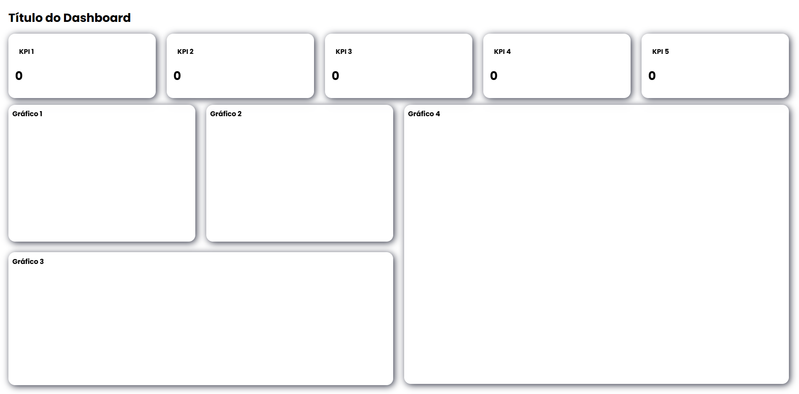

# 📊 Dashboard Template

Um template de dashboard responsivo desenvolvido com **HTMLe CSS**, ideal para criação de painéis administrativos, indicadores (KPIs) e visualização de dados através de gráficos interativos.

---

## 📌 Estrutura do Dashboard

### KPIs

O dashboard possui cinco cartões destinados à apresentação de indicadores principais.

---

## 🚀 Como utilizar

2. Abra o arquivo `index.html` no navegador.

---

## 🎨 Personalização

Você pode alterar facilmente:

* Título do dashboard
* Títulos dos KPIs
* Cores do tema
* Quantidade de gráficos
* Layout dos cartões

---

## 🛠 Tecnologias

* HTML5
* CSS3

---

## 📷 Layout

---

